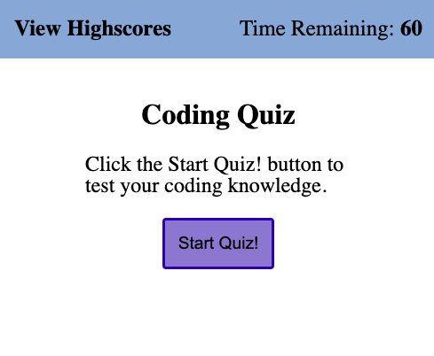
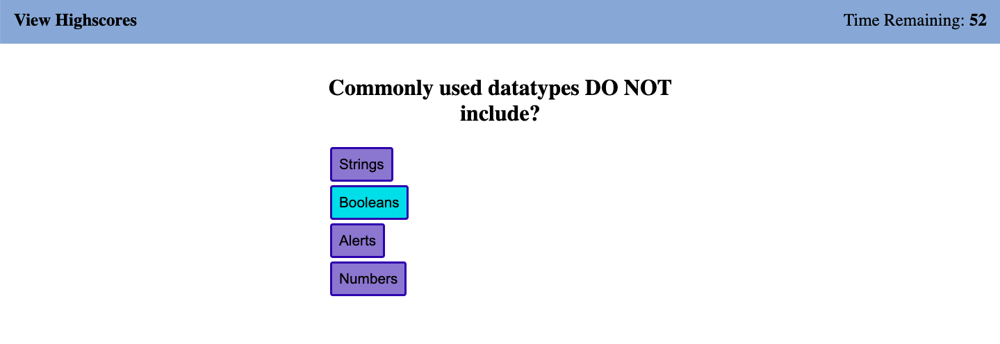
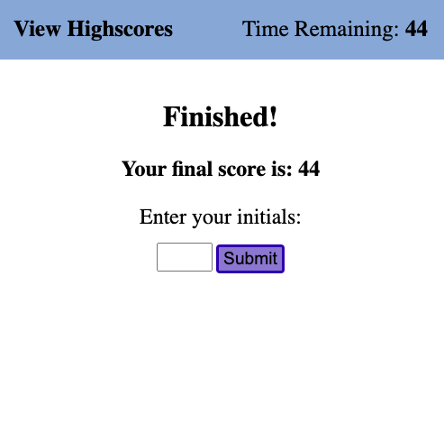
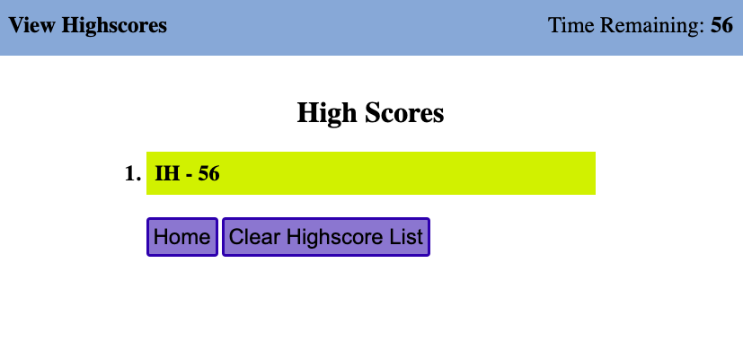

# coding-quiz
Entry level coding quiz generated through use of Web APIs

1. [ Description. ](#desc)
2. [ Web Address. ](#web-address)
3. [ Usage tips. ](#usage)

<a name="desc"></a>
## 1. Description

### This is the official site for Ian Hinnenkamp's coding-quiz brought to you by Web-APIs.

Desktop screen:


Smaller devices screen example:



<a name="web-address"></a>
## 2. How to Get There

### Open your preferred web browser and enter the following web address to access.

```html
file:///Users/ianhinnenkamp/bootcamp/coding-quiz/index.html
```
<a name="usage"></a>
## 3. Usage Tips

### Click the Start Quiz! button to start the quiz, or view the highscore list

Start Quiz:



Save your highscore:



View Highscores:

